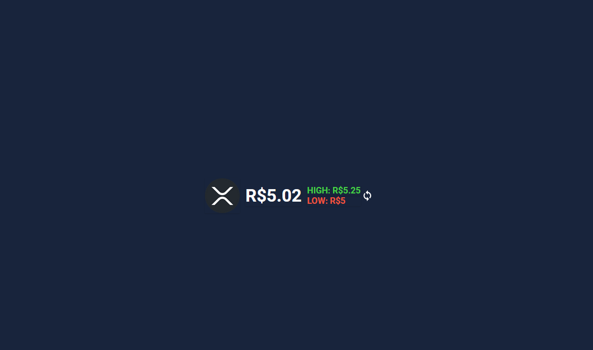

[![LinkedIn][linkedin-shield]][linkedin-url]

<!-- PROJECT LOGO -->

  <h2 align="center">Cripto Coins</h2>

 :computer: <a href="https://criptocoinsbr.netlify.app/">Ver Demo</a>
    :grey_question: <a href="https://github.com/B-Schmitz/cripto-coins/issues">Reportar um Bug</a>
 

<!-- ABOUT THE PROJECT -->
# Sobre o projeto

Esse projeto tem por objetivo reunir algumas famosas cripto moedas, mostrando seu valor atual, minima e máxima do dia, e futuras atualizações como log e calculadora de conversão.

## Screenshot

 

## Desenvolvido com

* [Javascript](https://developer.mozilla.org/pt-BR/docs/Web/JavaScript)
* [CSS](https://developer.mozilla.org/pt-BR/docs/Web/CSS)

<!-- CONTACT -->

## Contato

#### :briefcase: [Linkedin](https://www.linkedin.com/in/bernardo-ssantos/)
#### :e-mail: bernardo_schmitz@live.com

[linkedin-shield]: https://img.shields.io/badge/-LinkedIn-black.svg?style=for-the-badge&logo=linkedin&colorB=555
[linkedin-url]: https://www.linkedin.com/in/bernardo-ssantos/
